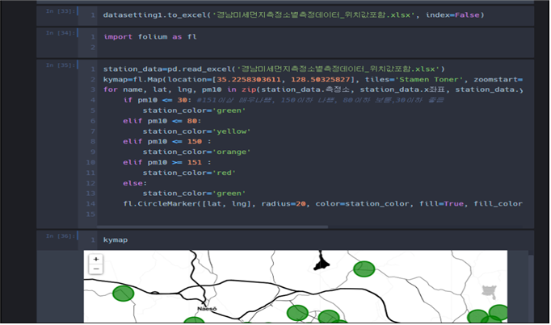

# gyeongnam-air-quality-map-Py
경상남도 지역의 실시간 미세먼지 및 초미세먼지 농도를 지도로 시각화하여 제공하는 미니프로젝트

### 프로젝트 개요

이 프로젝트는 공공 API를 활용하여 실시간 미세먼지 및 초미세먼지 농도를 확인하고, 이를 지도에 시각화하여 제공하는 것을 목표로 합니다. 특히 경상남도 지역을 중심으로 데이터를 수집하고 분석하여, 지역 주민들이 외출 전 미세먼지 정보를 쉽게 확인하고 건강을 관리할 수 있도록 돕는 데 중점을 두고 있습니다.

### 주요 기능

* **실시간 데이터 수집**: 한국환경공단에서 제공하는 API를 통해 경상남도 지역의 측정소별 미세먼지 및 초미세먼지 농도 데이터를 실시간으로 수집합니다.
* **지도 시각화**: Folium 라이브러리를 사용하여 수집된 데이터를 지도에 시각화합니다. 각 측정소의 위치를 표시하고, 미세먼지 및 초미세먼지 농도에 따라 다른 색상의 원으로 표현하여 직관적으로 정보를 전달합니다.
* **상세 정보 제공**: 지도 상의 각 측정소에 마우스를 올리면 해당 측정소의 실시간 농도 정보를 확인할 수 있습니다. 또한, 측정소를 클릭하면 측정소의 이름을 표시하여 사용자 편의성을 높였습니다.

### 활용 방안

* **외출 전 건강 관리**: 외출 전 미세먼지 농도를 확인하여 마스크 착용 여부, 외출 시간 조정 등 건강 관리에 활용할 수 있습니다.
* **실외 활동 계획**: 야외 모임, 캠핑, 운동 등 실외 활동 계획 시 미세먼지 정보를 참고하여 활동 장소 및 시간을 조정할 수 있습니다.
* **미세먼지 정보 공유**: 가족, 친구 등 주변 사람들과 미세먼지 정보를 공유하여 함께 건강을 지킬 수 있습니다.

### 기대 효과

* **미세먼지로 인한 건강 피해 최소화**: 실시간 미세먼지 정보 제공을 통해 미세먼지로 인한 건강 피해를 예방하고 최소화할 수 있습니다.
* **대기 환경 정보 접근성 향상**: 사용자 친화적인 지도 시각화를 통해 대기 환경 정보에 대한 접근성을 높이고, 정보 활용도를 제고할 수 있습니다.
* **환경 문제 인식 제고**: 미세먼지 정보를 시각적으로 제공함으로써 환경 문제에 대한 인식을 높이고, 환경 보호에 대한 관심을 증진시킬 수 있습니다.

### 데이터 및 기술 스택

* **데이터**: 한국환경공단_에어코리아_대기오염정보 API, 한국환경공단_에어코리아_측정소정보 API
* **기술 스택**: Python, Pandas, Folium, Requests, JSON

### 작동방식

---

### 프로젝트 실행 방법

1. 필요한 라이브러리를 설치합니다.
2. 공공데이터포털에서 API 활용 신청 후 발급받은 인증키를 코드에 입력합니다.
3. 코드를 실행하여 데이터를 수집하고 지도를 생성합니다.

### 참고 사항

* 본 프로젝트는 경상남도 지역을 중심으로 데이터를 수집하고 분석하였습니다. 다른 지역에 대한 정보는 제공되지 않습니다.
* 실시간 데이터 수집 및 지도 생성에는 다소 시간이 소요될 수 있습니다.
* 인터넷 연결이 필요합니다.

### 개선 방향

* **데이터 분석 기능 추가**: 수집된 데이터를 분석하여 미세먼지 변화 추이, 지역별 미세먼지 농도 비교 등 다양한 정보를 제공할 수 있습니다.
* **알림 기능 추가**: 특정 지역의 미세먼지 농도가 기준치를 초과할 경우 사용자에게 알림을 제공하는 기능을 추가할 수 있습니다.
* **모바일 앱 개발**: 모바일 앱을 개발하여 사용자들이 언제 어디서나 미세먼지 정보를 확인할 수 있도록 편의성을 높일 수 있습니다.

 
